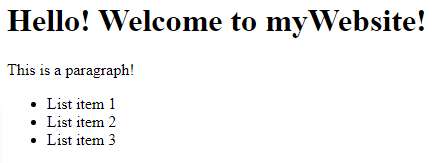

import Tabs from '@theme/Tabs';
import TabItem from '@theme/TabItem';

---

title: How to create a website
authors: [gray]
tags: [WebDev, CSS, HTML, Web hosting]
---

Hello! In today's blog entry I will be teaching you how to to create and upload a static website to the internet.

There are many options and methods for creating a website. In today's tutorial, you will:

- learn the difference between a Static and Dynamic website
- download the free tools needed to create a static website
- write HTML & CSS files for a website
- upload the website to a free host.

<!-- truncate -->

There are many tutorials on the internet that go into an enormous amount of depth on how to code a website. **This is not one of those tutorials**.
Rather, I intend to supply you with the guidance and direction so that you can use high quality tools and educational resources that already exist.

## Static vs Dynamic websites

When you enter a [URL](https://developer.mozilla.org/en-US/docs/Learn/Common_questions/What_is_a_URL) into your browser, you are connecting to a computer. These special purpose computers are called web servers.

Your computer will send a request for information to the web server. How the web server responds to that request depends on if you are visiting a Static or Dynamic website.

:::tip

Check out [this fantastic technical guide](<https://www.geeksforgeeks.org/static-vs-dynamic-website/>) explaining Static vs Dynamic websites by [GeeksforGeeks](https://www.geeksforgeeks.org/)

:::

### Static website

A static website will respond to your computer's request by sending back prebuilt files. Your browser can read these files as a blueprint for how to build the webpage that you see.

These files will typically be a combination of [**HTML, CSS, & JS**](https://www.freecodecamp.org/news/html-css-and-javascript-explained-for-beginners/) files.

The prebuilt files may be written by hand, or written by an automated tool like a [static site generator (SSG)](https://www.netlify.com/blog/2020/04/14/what-is-a-static-site-generator-and-3-ways-to-find-the-best-one/)

In any case, the files were already created ahead of time **before** your computer sent a request to the web server.

### Dynamic website

A dynamic website will

1. receive a request from your computer
2. proccess information about the request
3. generate files specifically for your request
4. respond by sending the custom files to your computer

Dynamic websites are generally more expensive to run, and more complicated to handle. These sites must be programmed in a [server side programming language](https://developer.mozilla.org/en-US/docs/Learn/Server-side/First_steps/Introduction) like PHP, Python's Django framework, or Node JS.

While they are a bit more trouble, Dynamic websites are just about the only way to handle sensitive information or computationally expensive operations. Third party plugins/widgets are available to abstract away most of these concerns for you on a Static Website, but they may come with a *$$$* price.

:::caution

If you need a website that handles user login, secure information, or anything that you would **not want everyone to access**, you will almost certainly need to use a dynamic website with server side code or a third party service.

:::

## Structure of a static website

A static website is typically written in two or three languages

- [HTML](https://developer.mozilla.org/en-US/docs/Learn/Getting_started_with_the_web/HTML_basics)
- [CSS](https://developer.mozilla.org/en-US/docs/Web/CSS)
- [JavaScript (JS)](https://developer.mozilla.org/en-US/docs/Web/JavaScript)

[HTML](https://developer.mozilla.org/en-US/docs/Learn/Getting_started_with_the_web/HTML_basics) is the foundation, structure, and backbone of your website. You can think of it as the bones of the human body or the steel beams of a building.

[CSS](https://developer.mozilla.org/en-US/docs/Web/CSS) controls how you see the website. It can be thought of a person's make up / cosmetics or the facade of a building.

[JavaScript (JS)](https://developer.mozilla.org/en-US/docs/Web/JavaScript) is not necessary for simple websites. JS can be thought of a brain or control center. Javascript allows you to move things around or change the prebuilt webpage. Unlike server side code that runs on a webserver, JavaScript is [client side code](https://i.pinimg.com/originals/00/14/57/001457b69f192f237f765006aa26036d.jpg). JS runs on the computer of the website's visitor.

:::info

You may notice that I am linking to [**MDN (Mozilla web docs)**](https://developer.mozilla.org/en-US/docs/Web) in most of my links. This is because **MDN is the definitive resource for high quality documentation on HTML, CSS, & JS**. If you have a question about how something in one of these languages work, it will be documented here.

:::

## Tools

To build a website, we first need an environment to create it in. You wouldn't cook food in your bathroom, and you wouldn't code in a word document.

You need an effective and functional place to write code. With the correct tools you will write better code in less time.

1. Download [Visual Studio Code (VS Code)](https://code.visualstudio.com/).
2. Install & Launch VS Code.
3. Watch and follow the first 9 minutes & 20 seconds of [this YouTube video](https://www.youtube.com/watch?v=XLDwqmXnmgI) to familiarize yourself with the user interface.
   - **Disregard everything after the 9 minute 20 second mark**, in this tutorial will be using a different set of extensions.
   - If the video is a bit slow for you, change the playback speed to 1.25 or 1.5
4. Go to **File > Preferences > Settings and search for "auto save". Open the drop down menu and select "onWindowChange".**

### Extensions

#### Essential extensions

*These extensions are required for building a website*

- [Preview on Web Server](https://marketplace.visualstudio.com/items?itemName=yuichinukiyama.vscode-preview-server)
- [HTML CSS Support](https://marketplace.visualstudio.com/items?itemName=ecmel.vscode-html-css)

#### Optional extensions

*These extensions are optional, but extremely useful*

- [Path Intellisense](https://marketplace.visualstudio.com/items?itemName=christian-kohler.path-intellisense)
- [Class autocomplete for HTML](https://marketplace.visualstudio.com/items?itemName=AESSoft.aessoft-class-autocomplete)
- [Colorize](https://marketplace.visualstudio.com/items?itemName=kamikillerto.vscode-colorize)
- [HTML Tag Wrap](https://marketplace.visualstudio.com/items?itemName=bradgashler.htmltagwrap)
- [Prettier - Code formatter](https://marketplace.visualstudio.com/items?itemName=esbenp.prettier-vscode)

## Learning to code

Listed below are a few fantastic sources for learning to code:

- **HTML**
  - [MDN](https://developer.mozilla.org/en-US/docs/Web/HTML) (documentation)
  - [Codecademy](https://www.codecademy.com/learn/learn-html) (course)
  - [Codecademy](https://www.codecademy.com/learn/learn-html/modules/learn-html-elements/cheatsheet) (cheatsheet)
- **CSS**
  - [MDN](https://developer.mozilla.org/en-US/docs/Web/CSS) (documentation)
  - [Codeademy](https://www.codecademy.com/learn/learn-css) (course)
  - [Codecademy](https://www.codecademy.com/learn/learn-css/modules/syntax-and-selectors/cheatsheet) (cheatsheet)
  - [CSS-Tricks](https://css-tricks.com/) (blog)
  - [Web Dev Simplified](https://www.youtube.com/c/WebDevSimplified) (Youtube)

:::tip

**I recommend following the [Codecademy](https://www.codecademy.com/) tutorials until you understand the basics**. Then, try try try! Follow your imagination. The more you fail, the faster you will learn. The only way to truly learn to code is to just start coding and learn while you do it! The [**MDN Web Docs**](https://developer.mozilla.org/en-US/) will be your best source for figuring out how things work.

:::

## Writing code

All of the code you need to get started will be provided here. You are encouraged to modify and add your own code as you feel comfortable with doing so.

First, create a folder. You can place it anywhere you want, but I recommend placing it on your desktop. Name the folder `websiteProjects`. Open the folder and create another folder named `myWebsite`. All of the content of the website you are building will be contained in the `myWebsite` folder. This is known as the **root folder** of your website.

Inside of VS Code *click* **File > Open Folder >** *Navigate to* `myWebsite` *and open the folder. click* **Select Folder**.

On the left side of the screen in the Explorer, you will find a tab named `myWebsite`. This represents the **root folder** of your project. *Right click* `myWebsite` *and select* **New File**. *Name this file* `index.html` This will be the homepage of our website. It is named `index.html` because that is the standard convention that browsers know will be your homepage.

Alright, lets put your programming knowledge to the test and add some code to `index.html`!

### HTML

```html title="index.html"
<!DOCTYPE html>
<html lang="en">
  <head>
    <meta charset="UTF-8" />
    <meta http-equiv="X-UA-Compatible" content="IE=edge" />
    <meta name="viewport" content="width=device-width, initial-scale=1.0" />
    <title>This is myWebsite!</title>
  </head>
  <body>
    <h1>Hello! Welcome to myWebsite!</h1>
    <p>This is a paragraph!</p>
    <ul>
      <li>List item 1</li>
      <li>List item 2</li>
      <li>List item 3</li>
    </ul>
  </body>
</html>
```

### Preview



Awesome, pat yourself on the back because you have your first website! It's not much, but it's a website. To see it in your own browser, save the `index.html` file by clicking the <kbd>Ctrl</kbd> + <kbd>S</kbd> keys. Next, click + <kbd>Ctrl</kbd> + <kbd>Shift</kbd> + <kbd>L</kbd>.

This should have opened a live preview of `index.html` in your default browser. Make a change to the page and save it. Watch how the preview automatically updates your changes!

:::note

If you followed **step 4** under [**Tools**](#tools) you do not need to press <kbd>Ctrl</kbd> + <kbd>S</kbd> to save the file. The moment you click any window other than VS Code, such as your browser, the file will save.

:::
:::caution

When in doubt, **always save your files** using <kbd>Ctrl</kbd> + <kbd>S</kbd> to prevent lost work.

:::

## Add style

:::danger Notice:

**This blog article is a work in progress!** Last edited: ***April 30, 2022***

:::

## Uploading to the internet
